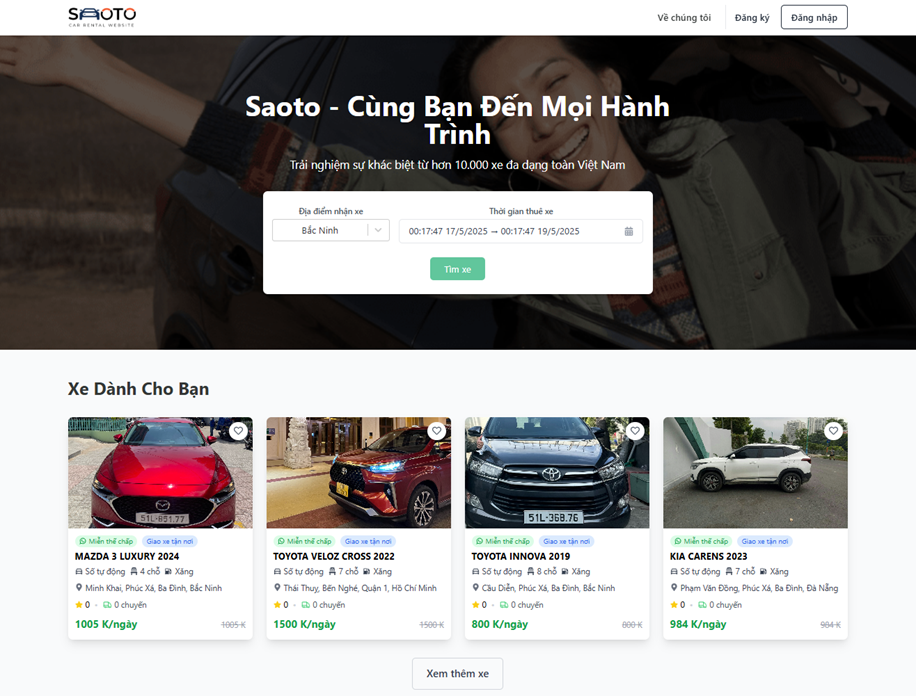
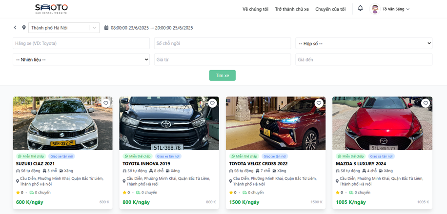
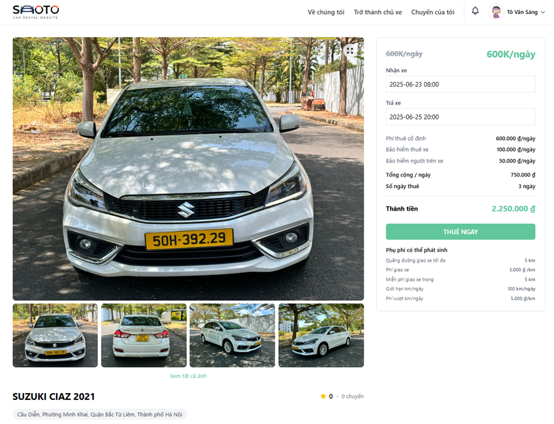
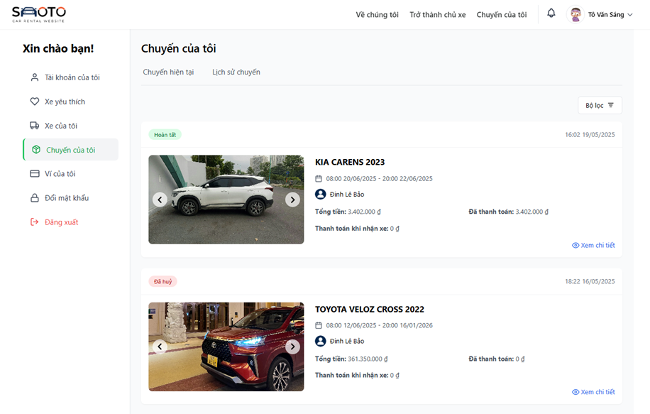
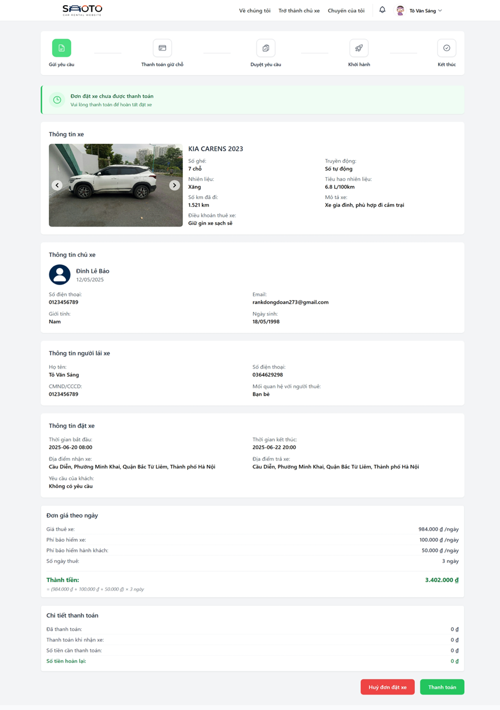
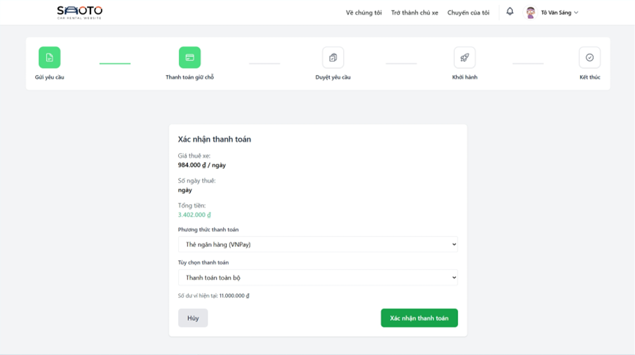
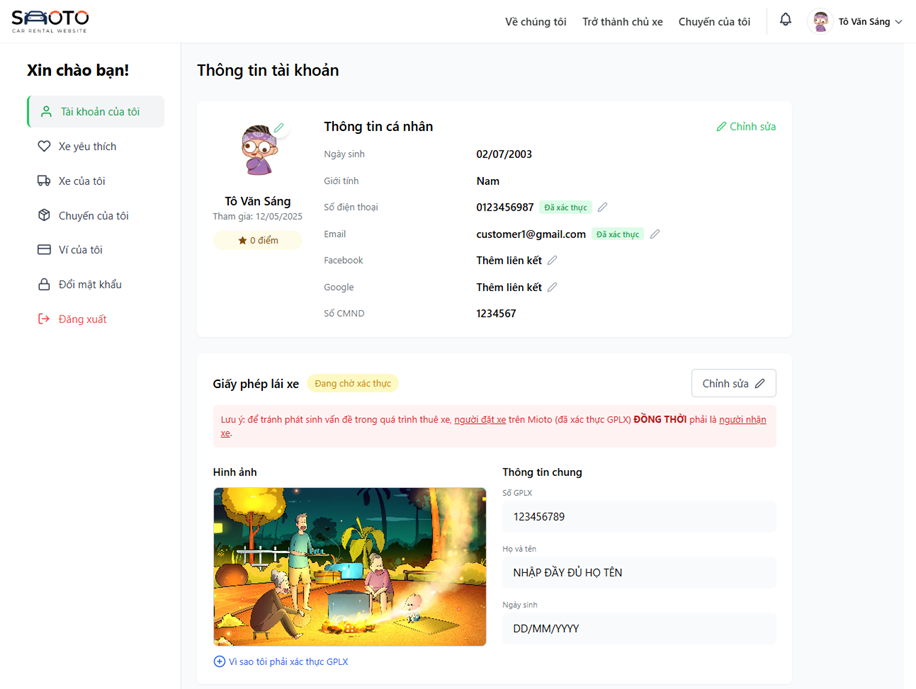
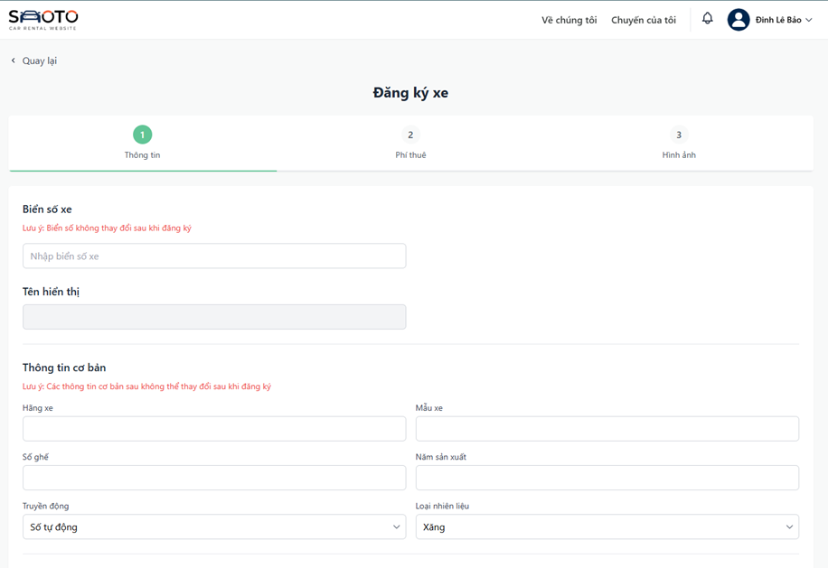
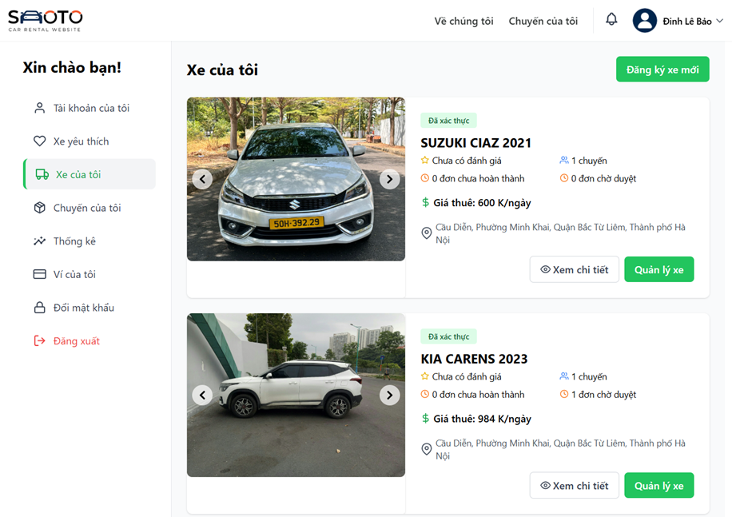
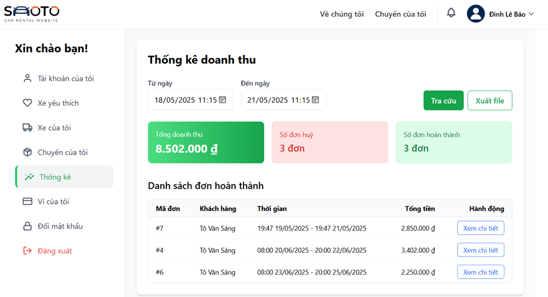

# 🚗 Website Quản Lý Cho Thuê Xe Ô Tô

## 📌 Giới thiệu dự án

Website quản lý cho thuê xe ô tô giúp khách hàng dễ dàng đặt thuê xe trực tuyến và hỗ trợ quản lý hợp đồng, thanh toán, lịch thuê xe cho chủ xe.

---

## 🛠️ Công nghệ sử dụng

- **Backend:** Spring Boot
- **Frontend:** ReactJS / TailwindCSS
- **Cơ sở dữ liệu:** MySQL
- **Triển khai:**
- **Khác:** JWT, REST API

---

## 🔑 Các tính năng chính

1. **Đăng ký / Đăng nhập**
2. **Tìm kiếm & đặt xe**
3. **Quản lý đơn đặt xe & thanh toán**
4. **Đăng ký xe & quản lý xe**
5. **Báo cáo doanh thu & thống kê & đánh giá**
6. **Quản lý người dùng & phân quyền**

---

## 🚀 Hướng dẫn cài đặt

### 1. Clone dự án
- **Backend:**
```bash
git clone https://github.com/SangToVan/rental_car_server
cd rental_car_server
```

- **Frontend:**
```bash
git clone https://github.com/SangToVan/rental_car_frontend
cd rental_car_frontend
```

### 2. Cài đặt backend

```bash
cd rental_car_server
./mvnw install
./mvnw spring-boot:run
```

### 3. Cài đặt frontend

```bash
cd rental_car_frontend
npm install
npm start
```

---

## 📦 Tài khoản mẫu

<!-- Nếu có sẵn tài khoản test -->

- **Admin:** admin@example.com / 123456
- **User:** user@example.com / 123456

---

## 🖼️ Ảnh minh họa

<!-- Thêm ảnh screenshot giao diện -->


--
 
--

--

--

--

--

--

--

--

--

---

